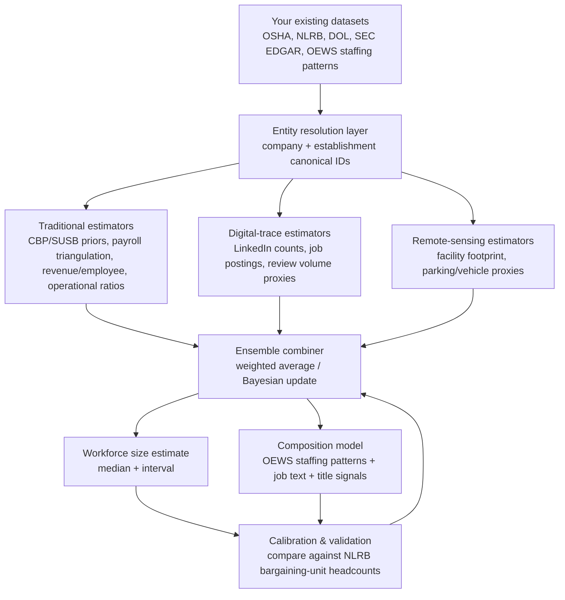

# Estimating Company Workforce Size and Composition From Outside Sources

## Executive summary

You can usually estimate a company’s **workforce size** (how many workers) and **workforce composition** (what kinds of jobs/occupations and where they sit) from the outside by combining three families of signals:

1. **Administrative “near-census” employer counts** that governments collect for other purposes (mainly unemployment insurance and tax/payroll administration). These are the most reliable building blocks, but they are often released **aggregated** (not company-specific) and come with **lags**. citeturn38view0turn38view1turn41view0  
2. **Public-company disclosures** (especially SEC filings) plus financial triangulation (revenue/payroll/benefits) that can turn dollars into headcounts—but only if you model pay levels and “who counts as an employee” carefully. citeturn38view3turn41view0  
3. **Digital-trace and remote-sensing proxies** (LinkedIn profiles, job postings, review volumes, satellite imagery) that are often timelier and sometimes establishment-specific, but introduce strong representation biases. citeturn39view0turn39view1turn39view2  

In practice, the best “outside view” systems behave like **ensembles**: they produce several independent estimates (each with its own bias profile), then combine them using calibrated weights and error models. The key advantage of your platform is that you already hold **ground-truth headcounts** for many specific workplaces via entity["organization","National Labor Relations Board","us labor relations agency"] bargaining-unit records. That gives you a rare ability to **measure bias and calibrate** the outside proxies (especially LinkedIn, job postings, and operational-coverage ratios) instead of guessing.

A realistic target, if you implement calibration and layering well, is:

- **Public company total employment**: often **±5–15%** when the company discloses employee count in filings and you use outside signals mainly for validation and segmentation; **±15–30%** if filings are vague and you must infer from proxies. citeturn38view3turn39view0  
- **Private company total employment**: typically **±20–50%** depending on industry and how much you can observe (locations, payroll hints, LinkedIn penetration).  
- **Single establishment employment**: can be **±10–25%** when you have strong location-specific signals (union/election records, OSHA case counts tied to an address, operational capacity, or satellite/footprint) and good calibration; otherwise **±30–70%** is common.

Those ranges are not universal constants—they are “engineering priors” you should continually update using your NLRB ground truth, because bias varies sharply by **NAICS, geography, wage level, and occupation mix**.

## Problem definition and measurement pitfalls

Workforce “size” is not one thing. A good platform explicitly distinguishes:

- **Employee headcount** (people) vs **FTEs** (full-time equivalents) vs **jobs** (positions). Many sources blur these.  
- **Firm vs establishment**: a “company” may own many local establishments; organizers often care about a **specific workplace location**.  
- **Payroll employees vs contractors**: many outside-view methods miss contractors or count them inconsistently. The entity["organization","U.S. Bureau of Labor Statistics","us labor statistics agency"] QCEW, for example, excludes categories such as proprietors/unincorporated self-employed and other groups not required to report UI employment. citeturn38view0  
- **Time alignment**: CBP and SUSB measure employment for the week of **March 12**, while other sources are quarterly or annual, so “true” comparisons require seasonal adjustment and growth-rate assumptions. citeturn38view1turn41view0  

A practical best practice: store every estimate as a **distribution** (e.g., median + 80% interval) instead of a single number, and keep a “definition tag” (headcount vs FTE; employees-only vs workers-including-contractors; point-in-time vs annual average).

## Traditional methods based on government, financial, and operational data

### QCEW

**Plain-language idea.** The QCEW is built from employer-reported employment and wage records tied to unemployment insurance systems. Conceptually: “Most employers file payroll and employment reports for UI; aggregate those reports to get employment counts and wages.” citeturn38view0  

**Inputs you need.**
- If you only have public aggregates: geography (state/county), NAICS industry, quarter/year.  
- If you have establishment identifiers in your own data (addresses from OSHA/NLRB/DOL): you can try to infer which QCEW “slice” a facility belongs to, but public QCEW won’t directly give “Company X at Address Y” without restricted microdata.

**Typical accuracy (practical ranges).**
- **At the level QCEW is designed for** (industry/geography totals): usually very high; operationally you can treat it as **±1–5%** for covered employment once revisions settle, primarily limited by reporting corrections and definitional exclusions. citeturn38view0  
- **For a specific company**, if you must *reconstruct* company totals by linking establishments through external data: accuracy is dominated by linkage error. A realistic starting range (before calibration) is often **±10–25%** if you have relatively clean establishment lists and stable naming, worse if not.

**Blind spots.**
- Excludes several worker types (e.g., proprietors/self-employed and others not required to report, plus various edge cases around “no wages in pay period”). citeturn38view0  
- Public QCEW is not a firm directory; it’s not meant to answer “how many employees does Company X have,” unless you have microdata access.

**How it fits your platform.** Treat QCEW as a **sector/geography prior** for “expected wage levels and employment density.” It’s a strong backbone for calibrating payroll-based headcount formulas and for sanity-checking outlier company claims against local labor-market totals.

### Census County Business Patterns (CBP)

**Plain-language idea.** CBP is an annual count of establishments, employment, and payroll, tabulated by geography and industry. It is explicitly establishment-oriented: “How many establishments exist in NAICS X in County Y, and how many employees are on payroll around mid-March?” citeturn38view1  

**Inputs you need.**
- Geography (ZIP/county/MSA/state/national) and NAICS.  
- For some use cases, establishment size class counts (how many establishments fall into each employment-size bin).

**Typical accuracy (practical ranges).**
- **For local totals by NAICS**: often **±2–10%** as a practical planning range (higher in small geographies/rare industries due to suppression and imputation).  
- **For a specific company**: CBP does not directly attribute counts to named companies. If you know the company’s number of establishments in an area and can slot each into the local size distribution, you might get **±20–50%** for company employment. If you do not know establishment count, uncertainty is usually larger.

**Blind spots / failure modes.**
- Time anchor: employment is “during the week of March 12,” which can be unrepresentative for strongly seasonal industries. citeturn38view1  
- Confidentiality suppression and size-bin reporting can make small-area inference noisy.  
- CBP’s usefulness as a company estimator depends on whether you can accurately enumerate the firm’s local establishments.

**How it fits your platform.** CBP is excellent for establishment-level priors: “A NAICS 7225 establishment in this ZIP typically has ___ employees.” You can blend that with your actual observed facility hints (OSHA events, NLRB unit sizes, job postings mentioning the site).

### Census Statistics of U.S. Businesses (SUSB)

**Plain-language idea.** SUSB is like CBP’s “firm/enterprise size” companion: it provides counts of firms and establishments with paid employees, employment (again anchored to the week of March 12), and annual payroll, broken out by industry and enterprise size. citeturn41view0  

**Inputs you need.**
- NAICS + geography, optionally firm-size bins.

**Typical accuracy (practical ranges).**
- **For industry/geography totals**: similar quality to CBP ranges (**±2–10%** typical planning range). citeturn41view0  
- **For a particular private company**: SUSB is not company-specific; it’s a benchmark distribution. On its own, it typically yields **±30–70%** uncertainty for any single firm because many firms can occupy the same size/industry bucket.

**Blind spots.**
- Provides distributions, not a directory.  
- Same March 12 timing anchor as CBP. citeturn41view0  

**How it fits your platform.** SUSB is best used as a **constraint**: “Given NAICS and observed signals, which firm-size bins are plausible?” It is especially useful for private companies when you can infer revenue band, footprint, or payroll proxies.

### BLS staffing patterns (OEWS and the industry-occupation matrix)

You already have a large “industry-occupation staffing patterns” table (113,473 rows). Conceptually, this is the key bridge from “how many workers” to “what kinds of workers.”

**Plain-language idea.** Start with an estimated total headcount for an establishment or firm, then allocate that headcount across occupations according to typical staffing mixes for that industry and geography. The entity["organization","U.S. Bureau of Labor Statistics","us labor statistics agency"] publishes industry-occupation matrix tables that describe occupational employment distributions by industry. citeturn41view1 The OEWS program provides occupational employment and wage estimates and warns users about limitations, especially for research estimates. citeturn38view2  

**Inputs you need.**
- NAICS for the company/establishment (often multiple NAICS for diversified firms).  
- Geography (state/region) if you want regional staffing adjustments.  
- Total headcount estimate (from any other method).

**Typical accuracy (practical ranges).**
- **Composition for broad occupational families** (e.g., production vs maintenance vs admin) when the NAICS is correct: often **±15–35% relative error** on shares as a starting expectation.  
- **Detailed SOC composition**: often **±25–60%**, because real staffing varies by product mix, technology, unionization, and subcontracting.

**Blind spots.**
- Staffing patterns describe “typical” industry mixes, not idiosyncratic company strategies (automation, staffing agencies, vertical integration).  
- Multi-establishment companies often have different staffing mixes by site (e.g., HQ vs warehouse vs retail).

**How it fits your platform.** Your platform can treat staffing patterns as the “default decomposition,” then use outside signals (job postings, LinkedIn titles, OSHA incident narratives) to reweight the occupation mix.

### Payroll triangulation

**Plain-language idea.** Convert money into people. If you can observe total payroll (or benefits participation) and you have a defensible average wage, then:

> headcount ≈ payroll ÷ average annual wage

For establishment-level work, you can use local wage priors from QCEW/CBP or occupation-weighted wages from OEWS-style tables, then invert. CBP and SUSB explicitly publish payroll measures alongside employment. citeturn38view1turn41view0  

**Inputs you need.**
- Payroll dollars for the unit you’re estimating (company, division, or establishment).  
- Wage distribution estimate for that unit (from industry/region + composition assumptions).

**Typical accuracy (practical ranges).**
- If payroll is measured consistently with your workforce definition and your wage estimate is good: **±10–30%** is achievable.  
- If payroll includes contractors, bonuses, stock comp, or global workforces not aligned with the site: **±30–80%** is common.

**Blind spots.**
- Payroll can be “global” while you need “U.S.”, or company-wide while you need a single location.  
- Average wage is the fragile point; wrong assumptions about overtime, part-time share, or occupational mix can dominate the error.

**How it fits your platform.** This is a strong method for public companies and large employers where you can observe payroll-like proxies (including from government data releases at aggregated levels) and then allocate to establishments using your establishment graph.

### Revenue-per-employee ratios

**Plain-language idea.** Another money-to-people inversion:

> headcount ≈ revenue ÷ (revenue per employee)

For public companies, revenue is easy; for private companies, revenue may be inferred (industry benchmarks, credit/ratings, procurement footprints).  

**Typical accuracy (practical ranges).**
- **Stable, labor-intensive sectors** (e.g., certain retail/service formats): often **±20–50%** if you compare to close peers with similar operating models.  
- **High variance sectors** (software, finance, energy, highly automated manufacturing): **±50–150%** is a realistic outside-view range because productivity dispersion is huge.

**Blind spots.**
- Unreliable when capital intensity differs (automation, outsourcing).  
- Revenue may be location-shifted inside corporate groups (transfer pricing, franchising), decoupling local workforce from local revenue.

**How it fits your platform.** Treat it as a **weak prior** that can keep you from being wildly wrong when other signals are missing—but don’t let it dominate unless you can calibrate it by NAICS and business model.

### Operational-coverage ratios

**Plain-language idea.** Convert “how much service/capacity exists” into “how many workers are needed to operate it,” using domain ratios:

- hospital beds → staff  
- student enrollment → teachers/staff  
- warehouse square footage / throughput → logistics workers  
- store count + hours → retail workers

**Typical accuracy (practical ranges).**
- When you have a direct capacity measure and a well-studied staffing ratio: **±5–20%** can be possible.  
- When you must guess service mix, shift coverage, or outsourcing: **±20–50%** is more typical.

**Blind spots.**
- Ratios are sensitive to: staffing model, union work rules, acuity/service complexity, and contractor usage.  
- Many organizations operate multiple shifts; a “snapshot” capacity metric can understate staffing if you forget 24/7 coverage.

**How it fits your platform.** This is one of the best establishment-level methods when you can extract reliable capacity indicators (regulatory filings, licensing, public inspection records, building footprints).

## Emerging and alternative methods using digital traces and remote sensing

image_group{"layout":"carousel","aspect_ratio":"16:9","query":["satellite parking lot car counting machine learning","LinkedIn company page employee count example","job postings analytics dashboard workforce"],"num_per_query":1}

### LinkedIn profile counting

**Plain-language idea.** Count how many entity["company","LinkedIn","professional social network"] members claim an employer, and optionally break down by title/location. People and companies self-report roles, which can be aggregated. LinkedIn itself documents using platform data to create labor market indicators and compares them to official statistics (e.g., correlations with BLS-based measures). citeturn39view0  

**Why it’s useful.**
- Timely: changes in profile counts can reflect growth/decline faster than lagged government releases. citeturn39view0  
- Rich composition signals: titles, skills, education, and location can be mapped into SOC/occupational groupings.

**Biases / failure modes.**
- Coverage bias: LinkedIn systematically under-represents many hourly and lower-digital-visibility occupations; it over-represents professional roles.  
- Multi-job / stale profiles: people may not update promptly, and some list holding-company employers instead of the operating unit.  
- Geographic misallocation: HQ-centric employer pages can hide establishment-level distribution.

**Practical accuracy ranges (outside view priors).**
- White-collar-heavy firms: often **±15–35%** for total headcount after calibration.  
- Blue-collar/service-heavy firms: often **±30–70%** unless you calibrate aggressively by industry and occupation mix.

**How to make it rigorous with your data.** Use your NLRB workplace headcounts to compute **industry×region calibration curves**:
- For each workplace with ground truth, measure LinkedIn-count-at-company and LinkedIn-count-near-location (if available), then estimate a **coverage factor**.  
- Model coverage factor as a function of NAICS, local wage level, and occupation mix (using OEWS patterns) and apply the corrected factor to new targets.

### Job posting analysis

**Plain-language idea.** Job postings measure hiring demand and can hint at current staffing levels and occupational composition. But postings are not the same as jobs filled: postings can be duplicated, evergreen, or placed by staffing agencies.

**Why it’s useful.**
- It provides **composition clues** (the types of roles the employer is recruiting).  
- It provides **directionality** (expansion vs contraction) in near real time.

**Known representativeness issues.** Burning Glass job-posting data, for example, has documented occupational skews: professional roles are over-represented compared with some official benchmarks, while several blue-collar/service categories are under-represented because they are posted online at lower rates. citeturn39view1  

**Practical accuracy ranges.**
- As a headcount estimator by itself: usually weak, often **±30–100%**, because “postings → headcount” requires assumptions about vacancy duration and hiring rates.  
- As a composition estimator (what job families exist): can be strong qualitatively; for numeric composition shares, a reasonable prior is **±20–50%** unless calibrated.

**How to make it rigorous.**
- Convert postings to implied hires with a simple stock–flow model:
  - vacancies ≈ postings × duplicate_adjustment  
  - hires ≈ vacancies ÷ average_time_to_fill  
- Calibrate average_time_to_fill and duplication by NAICS using your workplaces with known counts and observed posting volumes.

### SEC human-capital disclosures

**Plain-language idea.** Public companies file annual reports and other disclosures. The entity["organization","U.S. Securities and Exchange Commission","us securities regulator"] modernized Regulation S‑K to require a **description of human capital resources** and retained reference to disclosing number of employees where material, moving toward more principles-based “human capital measures or objectives.” citeturn38view3  

**Why it’s useful.**
- When a company discloses “number of employees,” that can be your highest-quality single datapoint for total headcount (though definitions vary). citeturn38view3  
- The narrative can reveal composition drivers (turnover focus, unionization mentions, reliance on contractors).

**Biases / failure modes.**
- Not standardized: firms decide what is “material,” so some disclose headcount and some do not. citeturn38view3  
- Definitions vary (global vs U.S.; employees vs “associates”; contractors).  
- Narrative quality varies widely and may be boilerplate.

**Practical accuracy ranges.**
- If headcount is explicitly reported: often **±0–5%** for that specific definition, but you still need to map to your desired definition (employees vs all workers).  
- If not reported: the method provides only qualitative features; numeric inference reverts to other methods.

### Glassdoor / Indeed review volume as proxies

**Plain-language idea.** Larger employers tend to have more reviews. You can fit a curve from (review count → employee count) using companies with known headcount and then infer unknowns.

**Why it’s useful.**
- It is sometimes one of the only signals for small/mid employers that do not appear in LinkedIn at scale.  
- It can be establishment-anchored if reviews often mention a location (though location extraction is messy).

**Core biases.**
- Participation bias: review propensity differs by occupation, wage level, and company culture.  
- Platform bias: entity["company","Glassdoor","job review site"] and entity["company","Indeed","job search website"] user bases differ; some industries are far more represented.

**Practical accuracy ranges.**
- Usually broad: **±50–200%** unless you calibrate by industry and region, because review counts are an indirect behavioral measure.

### Machine learning ensemble models

**Plain-language idea.** Instead of relying on one proxy, train a model that takes many features and predicts headcount and composition.

**Why it’s useful.**
- ML can learn stable corrections: “LinkedIn undercounts warehouses by X; job postings are more predictive for NAICS Y.”  
- It can represent uncertainty by outputting prediction intervals (or by ensembling).

**Major risks.**
- Models can “learn the dataset” instead of the world, especially if your ground truth over-represents unionized workplaces.  
- Feature leakage: if some features indirectly encode the answer (e.g., you accidentally include a field that already contains headcount).

**How your NLRB ground truth changes the game.**
- You can build a **calibration dataset** at the establishment level: (observed bargaining-unit headcount, OSHA signals, local CBP priors, LinkedIn counts, job postings, satellite proxy features).  
- You can validate out-of-sample by industry and geography, producing honest accuracy ranges per sector.

### Satellite imagery and physical-activity proxies

**Plain-language idea.** Use overhead imagery and computer vision to estimate activity and capacity (cars in parking lots, trucks at docks, building size/expansion), then map activity to staffing.

There is open research showing end-to-end pipelines that combine open maps with satellite imagery and machine-learning vehicle detectors to track vehicle flow over time. citeturn39view2  

**Why it’s useful.**
- It can be establishment-specific even when corporate data is opaque.  
- It is hard for a target to “spin” compared to self-reported digital profiles.

**Biases / failure modes.**
- Remote work breaks parking-lot logic for offices.  
- Shift work: a single image may miss peak staffing; you need time series.  
- Multi-tenant sites and shared lots can contaminate counts.

**Practical accuracy ranges.**
- For warehouses/manufacturing with dedicated lots and strong calibration: **±15–40%** is a plausible target.  
- For offices in dense areas: can be useless without better proxies.

## Commercial providers and what is replicable with free data

Even if you can’t buy these products, understanding their “secret sauce” helps you replicate the replicable components.

### entity["company","Revelio Labs","workforce analytics vendor"]

Revelio positions itself as workforce intelligence derived from online professional profiles and related digital signals (work histories, transitions, skills, titles), often marketed as “near real-time” labor market and firm workforce analytics. citeturn4search1  

**Likely replicable components (free/OSS approach).**
- Profile aggregation logic (at smaller scale) using public web data where permitted, plus careful de-duplication and entity resolution.  
- Occupation/title normalization and skill extraction using open-source NLP toolchains (see OSS section).

**Hard-to-replicate components.**
- Scale and coverage of proprietary profile datasets; identity resolution across multiple sources; normalization pipelines; and long-run historical snapshots.

### entity["company","People Data Labs","people data vendor"]

People Data Labs offers APIs for person/company datasets sourced from public web and partner sources, designed for enrichment (company attributes, people attributes, etc.). citeturn4search2  

**Replicable components.**
- Your own enrichment graph: merge corporate identifiers, web entities, and job-related attributes using public APIs and open crawling/extraction tools.

**Hard-to-replicate components.**
- Proprietary aggregation agreements and large-scale identity graph.

### entity["company","Lightcast","labor market analytics vendor"]

Lightcast (and predecessors) are strongly associated with large-scale job-postings aggregation and analytics. They typically emphasize cleaning/deduplication, classification to occupations/skills, and representativeness adjustments. citeturn4search3turn39view1  

**Replicable components.**
- Many “middle-layer” analytics steps are replicable: deduplication, SOC/skill extraction, and calibration to official distributions using OEWS-style staffing patterns and public benchmarks. citeturn39view1turn41view1  

**Hard-to-replicate components.**
- Persistent access to job board feeds and the operational burden of keeping scrapers working at scale.

### entity["company","Diffbot","knowledge graph company"]

Diffbot automates web extraction into structured knowledge graphs (entities like companies, people, products), using large-scale crawling and ML extraction. citeturn4search4  

**Replicable components.**
- Entity extraction and lightweight knowledge graph building using open-source crawlers + transforms.  
- Organization page parsing (e.g., “About us,” “Careers,” press releases) to capture location footprints and stated headcount.

**Hard-to-replicate components.**
- Whole-web scale crawling and the mature extraction/normalization stack.

## Open-source GitHub toolbox for a PostgreSQL-based platform

Star counts below are taken from GitHub pages retrieved on **2026‑02‑17** (your current system date). “Active” means either (a) a release/commit activity in roughly the last 12 months, or (b) the project is clearly under ongoing development; “Stale” indicates older releases/updates and likely extra integration risk.

Because “every relevant repo on GitHub” is effectively unbounded, this table is best read as a **curated, high-signal set** that maps directly onto the components you asked for (entity resolution, scraping, labor-market APIs, occupation/skill extraction, embeddings, and SEC parsing).

| Capability area | Project | GitHub URL | Stars | Active maintenance signal | Maintenance status | What it does | How it plugs into your 207+ table PostgreSQL platform |
|---|---|---:|---:|---|---|---|---|
| Entity resolution (probabilistic linkage) | Splink | `https://github.com/moj-analytical-services/splink` | 2k citeturn17view0 | Release v4.0.13 on Feb 12 (shown on releases page) citeturn26view0 | Active | Fellegi–Sunter-style probabilistic record linkage with scalable backends, including PostgreSQL support noted in docs. citeturn17view0turn26view0 | Use to build a **company↔establishment crosswalk** across OSHA/NLRB/DOL/SEC datasets. Store linkage pairs with scores in a dedicated `entity_link` schema; promote high-confidence matches to canonical IDs. |
| Entity resolution (ML + human labeling loop) | Dedupe | `https://github.com/dedupeio/dedupe` | 4.4k citeturn16view1 | Docs show Dedupe 3.0.2 citeturn43search14 | Active (but confirm release cadence) | Supervised/active-learning entity resolution for structured data; works well with “review uncertain pairs” workflows. citeturn16view1turn43search14 | Use when you can dedicate analyst review time for hard employer-name cases (e.g., complex parent/subsidiary naming). Store training labels from your team as “golden pairs.” |
| Entity resolution (classic toolkit) | recordlinkage | `https://github.com/J535D165/recordlinkage` | 1k citeturn18view0 | Latest release v0.16 on Jul 20, 2023 citeturn28search1 | Somewhat stale (release), still usable | Modular Python record linkage (blocking, comparison, classifiers). citeturn18view0turn28search1 | Good for prototyping and smaller datasets; export match results into Postgres tables, then backfill canonical entity IDs. |
| Data cleaning + reconciliation UX | OpenRefine | `https://github.com/OpenRefine/OpenRefine` | 11.7k citeturn18view1 | Release “3.10-beta2” dated Feb 10 on releases page citeturn26view1 | Active | Interactive data cleaning and reconciliation tool. citeturn18view1turn26view1 | Use for **manual cleanup of high-value targets** (top employers by risk/strategic value). Export cleaned CSVs back into Postgres staging tables. |
| Entity model + matching framework | OpenSanctions: nomenklatura | `https://github.com/opensanctions/nomenklatura` | 230 citeturn20view0 | “Updated Feb 17, 2026” on org page citeturn37view0 | Active | Framework + CLI for integrating and deduplicating entity data streams. citeturn37view0turn20view0 | Use as a consistent **entity graph layer** (canonical entities + aliases + identifiers). Strong fit if you want an auditable linkage pipeline. |
| Entity schema / investigative data model | OpenSanctions: followthemoney | `https://github.com/opensanctions/followthemoney` | 41 citeturn20view1 | “Updated Feb 17, 2026” on org page citeturn37view0 | Active | Defines a structured entity model and tooling for investigative entity datasets. citeturn37view0turn20view1 | Use to standardize organizations, addresses, identifiers (CIK, EIN where available), and relationships (subsidiary-of). |
| Address parsing / normalization | libpostal | `https://github.com/openvenues/libpostal` | 4.7k citeturn36view0 | “Updated Dec 6, 2025” on org page citeturn36view0 | Active | High-quality international address parsing/normalization using statistical NLP. citeturn36view0 | Critical for linking establishments across OSHA/NLRB/DOL when addresses are messy. Normalize, then geocode, then link. Store parsed components in `address_dim`. |
| Address parsing (US-focused) | usaddress | `https://github.com/datamade/usaddress` | 1.6k citeturn20view3 | Activity page exists (date not extracted here) citeturn43search0 | Unknown/needs check | US address parser designed for messy strings. citeturn20view3turn43search0 | Lightweight option for US-only establishment matching; useful in pre-processing before libpostal or geocoding. |
| Company name cleaning | cleanco | `https://github.com/psolin/cleanco` | 350 citeturn20view4 | Releases show updates including May 2024 notes citeturn42search3turn42search11 | Active-ish | Removes legal suffixes and attempts to infer organization type. citeturn42search7turn42search11 | Use early in your pipeline to normalize “Inc/LLC/Corp” noise before fuzzy matching across datasets. Persist “clean_name” fields. |
| Fast fuzzy matching | RapidFuzz | `https://github.com/rapidfuzz/RapidFuzz` | 3.7k citeturn20view5 | Release 3.14.3 on Nov 1, 2025 citeturn42search1 and activity updated Jan 26, 2026 citeturn43search3 | Active | High-performance string similarity (replacement for older fuzzywuzzy). citeturn20view5turn42search1 | Use for candidate generation (blocking) in entity resolution; store similarity scores for auditability. |
| Web scraping framework | Scrapy | `https://github.com/scrapy/scrapy` | 59.8k citeturn22view0 | Release 2.14.1 on Jan 12 (releases page) citeturn26view2 | Active | Industrial-strength crawling/scraping framework. citeturn22view0turn26view2 | Backbone for scraping company “Careers” pages and public location lists. Land raw HTML into Postgres, then parse into structured tables. |
| Browser automation (anti-bot resilience) | Playwright for Python | `https://github.com/microsoft/playwright-python` | 14.3k citeturn22view1 | Latest release v1.58.0 on Jan 30, 2026 (repo summary) citeturn42search4 | Active | Automates modern browsers; useful for JS-heavy job sites and dynamic pages. citeturn22view1turn42search4 | Use for scraping where static HTML fails. Run in controlled jobs; save structured results (jobs, locations) into Postgres staging. |
| Browser automation (legacy ecosystem) | Selenium | `https://github.com/SeleniumHQ/selenium` | 34k citeturn22view2 | Releases show Selenium 4.40.0 on Jan 18 (releases page) citeturn26view4 | Active | Broad browser automation ecosystem. citeturn22view2turn26view4 | Useful when Playwright is blocked or you need existing Selenium tooling; same integration pattern as Playwright. |
| Job board scraping (high risk of TOS issues) | JobSpy | `https://github.com/speedyapply/JobSpy` | 2.8k citeturn22view3 | Latest release v1.1.79 on Mar 21, 2025 citeturn40search1turn40search0 | Active (but operationally brittle) | Aggregates postings from multiple job boards; includes proxy support. citeturn21search3turn40search0 | Use with caution. Prefer scraping employers’ own career pages or permitted feeds. If used, isolate legally/operationally in a separate pipeline and store only derived features. |
| Programmatic Census API access | census (Python wrapper) | `https://github.com/datamade/census` | 680 citeturn20view6 | Repo exists; commit recency not extracted here citeturn43search1 | Unknown/needs check | Python wrapper for U.S. Census API. citeturn20view6turn43search1 | Use to pull ACS or geography metadata to improve establishment geographies, commuting zones, and local denominators. |
| Programmatic BLS API access | bls (Python) | `https://github.com/OliverSherouse/bls` | 84 citeturn20view7 | Repo exists; maintenance not assessed here citeturn20view7 | Unknown/needs check | Python library for BLS API usage. citeturn20view7 | Use to automate pulls (OEWS/QCEW-related series where available) into staging tables. |
| Programmatic BLS API access | blsAPI (R) | `https://github.com/mikeasilva/blsAPI` | 94 citeturn20view8 | Repo exists; maintenance not assessed here citeturn20view8 | Unknown/needs check | R wrapper for BLS API. citeturn20view8 | Useful if part of your pipeline is in R; otherwise optional. |
| QCEW programmatic tooling | qcew (Node) | `https://github.com/mhkeller/qcew` | 12 citeturn20view9 | Repo exists; likely minimal maintenance citeturn20view9 | Likely stale | NodeJS interface for QCEW. citeturn20view9 | Consider as reference code; for production, you may write your own downloader aligned to your schema. |
| QCEW bulk download + DB import | qcew-data | `https://github.com/armollica/qcew-data` | 7 citeturn20view10 | Repo exists; maintenance unclear citeturn20view10 | Likely stale | Scripts to download QCEW and import into a database. citeturn20view10 | Potential quick-start for your QCEW ingestion jobs; adapt to your 207-table schema and job scheduler. |
| SEC filings access + parsing | edgartools | `https://github.com/dgunning/edgartools` | 1.7k citeturn25view0 | Release v5.16.0 on Feb 14 (releases page) citeturn27view0 | Active | Access and analyze SEC filings including text extraction and XBRL workflows. citeturn25view0turn27view0 | Use to extract employee counts/human-capital sections from 10‑Ks into structured fields, then run your workforce estimators. |
| SEC bulk download | sec-edgar-downloader | `https://github.com/jadchaar/sec-edgar-downloader` | 657 citeturn25view1 | Repo exists; maintenance not assessed here citeturn25view1 | Unknown/needs check | Downloads filings by CIK/ticker/form type. citeturn25view1 | Use as an ingestion tool feeding your existing EDGAR tables; schedule incremental pulls and store raw filings. |
| SEC downloader convenience layer | sec-downloader | `https://github.com/Elijas/sec-downloader` | 52 citeturn25view2 | Repo exists; maintenance unclear citeturn25view2 | Unknown | Convenience wrapper built on sec-edgar-downloader. citeturn25view2 | Possibly useful for specific workflows; edgartools is likely the stronger long-term base. |
| XBRL parsing | Arelle | `https://github.com/Arelle/Arelle` | 168 citeturn25view3 | Repo has large commit history; explicit recency not extracted here citeturn25view3 | Unknown/needs check | Open XBRL platform used widely in XBRL workflows. citeturn25view3 | If you need deep XBRL parsing beyond edgartools, use Arelle as the XBRL engine and store normalized facts in Postgres. |
| Skill extraction / job-text NLP | skills-ml | `https://github.com/workforce-data-initiative/skills-ml` | 174 citeturn23view0 | “Updated Dec 2, 2024” on org page citeturn35view5 | Somewhat stale | NLP/ML methods for labor market data: skill extraction, occupation classification workflows. citeturn31search8turn35view5 | Use to process scraped job postings into skill entities and SOC-like signals, then compare to OEWS staffing patterns and your organizer targeting heuristics. |
| Skill extraction | SkillNER | `https://github.com/AnasAito/SkillNER` | 203 citeturn23view2 | Releases page exists (shows tagged releases) citeturn31search2 | Active-ish | Rule-based skill extraction from text using a skills knowledge base. citeturn23view2turn31search2 | Fast path to extracting skill signals from postings; store `(posting_id, skill_id, confidence)` rows for downstream analytics. |
| Occupation classification (SOC in text) | sockit | `https://github.com/ripl-org/sockit` | 22 citeturn23view3 | Repo exists; maintenance unclear citeturn23view3 | Unknown/needs check | NLP toolkit for SOC-related signals from titles/postings/resumes. citeturn23view3 | Use to map scraped job titles into SOC codes; join SOC to OEWS wages and staffing patterns for composition modeling. |
| Occupation support data | sockit-data | `https://github.com/ripl-org/sockit-data` | 3 citeturn23view4 | Repo exists; maintenance unclear citeturn23view4 | Likely stale | Data companion for sockit. citeturn23view4 | Ingest as reference tables into Postgres (SOC lexicons, mappings). |
| Skills taxonomy from postings | skills-taxonomy-v2 | `https://github.com/nestauk/skills-taxonomy-v2` | 36 citeturn23view5 | Repo exists; maintenance unclear citeturn23view5 | Unknown | Open skills taxonomy built from job posting data (UK-oriented). citeturn23view5 | Useful as a blueprint for building a US-focused skills taxonomy from postings; integrate as a reference embedding/taxonomy layer. |
| Skill embeddings | skill2vec | `https://github.com/duyet/skill2vec` | 34 citeturn23view6 | Repo exists; maintenance unclear citeturn23view6 | Likely stale | Learns vector representations of skills. citeturn23view6 | Use embeddings to cluster skills and map posting text into skill space; store vectors in Postgres (pgvector) for similarity search. |
| Skill embeddings (data/model) | skill2vec-dataset | `https://github.com/duyet/skill2vec-dataset` | 84 citeturn23view7 | Repo exists; maintenance unclear citeturn23view7 | Likely stale | Dataset + pretrained model for skill2vec. citeturn23view7 | Seed your embedding layer quickly; retrain later on your own postings corpus. |
| Company embeddings | company2vec | `https://github.com/eddiepease/company2vec` | 49 citeturn24view0 | Repo exists; maintenance unclear citeturn24view0 | Unknown | Generates company name embeddings. citeturn24view0 | Useful for fuzzy company similarity and candidate generation in entity resolution; store embeddings for nearest-neighbor match suggestions. |
| Industry embeddings (archived) | industry2vec | `https://github.com/ing-bank/industry2vec` | 29 citeturn24view2 | Archived Sep 30, 2020 citeturn24view2 | Not active | Industry code embeddings; archived. citeturn24view2 | Treat as research reference; do not depend on it operationally without forking and modernizing. |

## Layered estimation recipes and calibration using NLRB ground truth

The recipes below are written as operational playbooks. Each one produces: (a) a best estimate, (b) an uncertainty range, and (c) a decomposition into occupations.

### A unified data-flow diagram

### Public company recipe

This is the easiest case because there is often a filing-based anchor.

1. **Extract “employee count” and human-capital text from 10‑K/annual report filings.** The SEC’s modernization of Item 101 explicitly frames human-capital disclosure and retains the employee-number concept within the broader human-capital topic. citeturn38view3  
   - If the company discloses employee count explicitly, treat it as your baseline for total headcount and start with **±5–15%** uncertainty (definition-mapping risk dominates, not arithmetic).
2. **Normalize the definition.** Tag whether the disclosed number is global or domestic, employees-only or “associates,” and whether contractors are excluded. (This is where error enters even when the number is “exact.”) citeturn38view3  
3. **Cross-check with outside proxies.**
   - Compare to LinkedIn employee count and title mix (do not trust it as the baseline; use it as a drift detector). LinkedIn-based measures can correlate strongly with external labor indicators but are not universally representative. citeturn39view0  
   - Compare job-posting volume trend against implied growth (hiring demand rising while headcount falling is a red flag). Job posting datasets have known representativeness skews by occupation. citeturn39view1  
4. **Allocate headcount to occupations and subunits.**
   - Use your OEWS staffing patterns / BLS industry-occupation matrix as the starting occupational distribution. citeturn41view1  
   - Reweight with evidence: job postings (what they’re hiring), LinkedIn title distribution (what people report), and any establishment signals in OSHA/NLRB records.
5. **Quantify uncertainty via an ensemble approach.**
   - Example: if SEC says 10,000 employees (±10%), LinkedIn suggests 8,500 (±30%), and revenue-per-employee suggests 12,000 (±50%), a simple inverse-variance weighted combine often yields an interval closer to **±8–15%** than any single proxy—assuming errors are not perfectly correlated.
6. **Calibrate against your NLRB ground truth at the establishment level.**
   - For public companies where you have NLRB bargaining-unit counts at specific sites, treat those as “truth” for that site and compute how well each estimator predicts it.  
   - Over time, you learn a company- and industry-specific bias correction: e.g., “LinkedIn captures 0.35 of warehouse headcount but 0.85 of HQ headcount.”

### Private company recipe

No SEC anchor means you need a stronger ensemble and heavier use of establishment enumeration.

1. **Build an establishment footprint.**
   - Use your internal OSHA / NLRB / DOL records to identify addresses tied to the employer name variants, then deduplicate addresses and entities using Splink/Dedupe/libpostal-style normalization. citeturn17view0turn36view0  
2. **Use CBP/SUSB to create priors.**
   - For each inferred establishment, use CBP-like local priors: establishments/employment/payroll for the relevant NAICS/geography. CBP measures employment and payroll (March 12 anchor). citeturn38view1  
   - Use SUSB to constrain plausible firm-size bins for the inferred NAICS/geography. citeturn41view0  
3. **Add outside digital traces.**
   - LinkedIn count for the company name(s), but apply a calibrated “coverage factor” learned from NLRB-labeled sites. citeturn39view0  
   - Job postings volume and mix for growth and composition hints, correcting for known occupational skews. citeturn39view1  
4. **Convert operational signals into headcount when available.**
   - If the company operates facilities with measurable capacity (beds, seats, routes, production lines), use operational coverage ratios. This can dominate accuracy when well-specified.
5. **Combine and report.**
   - Without a filing anchor, a realistic target after calibration is **±20–50%** for total headcount, tightening toward **±15–30%** if you have dense establishment footprints and strong calibrated LinkedIn/postings signals.

### Single establishment recipe

This is usually the most actionable for organizers—and where your NLRB ground truth is most valuable.

1. **Canonicalize the establishment.**
   - Parse/normalize the address (libpostal/usaddress), geocode, store canonical lat/long + standardized address components. citeturn36view0turn20view3  
2. **Determine functional NAICS for the site.**
   - Use your OSHA narratives, DOL context, and job postings referencing the site to infer the site’s operational NAICS (often differs from parent NAICS).
3. **Produce multiple independent size estimates.**
   - **Local CBP prior** for that NAICS/geography (typical establishment sizes). citeturn38view1  
   - **Operational capacity** (square footage, beds, enrollment, etc.).  
   - **Satellite/vehicle proxy** if the site has a dedicated footprint and you can build a time series; vehicle-flow ML pipelines exist in open research. citeturn39view2  
   - **LinkedIn localized count** (employees listing the site city / location keywords), calibrated by NAICS/occupation.
4. **Use your NLRB ground truth if present.**
   - If the establishment has bargaining-unit headcount records, treat that as the target headcount for that unit definition and update/correct other proxies.
5. **Estimate composition.**
   - Start with OEWS staffing pattern for that NAICS, then reweight using job postings and any site-specific title evidence. citeturn41view1turn39view1  

**Expected improvement from layering:** If you can obtain three reasonably independent establishment-level estimates each around ±30%, and at least one is calibrated on similar sites using NLRB truth, it is often realistic to compress uncertainty to roughly **±15–25%** for the establishment, with much better relative ranking of targets than any single method.

## Gaps in open source and what likely must be built from scratch

Even with strong open-source building blocks, several “platform-critical” components are still missing or underdeveloped for your specific mission:

1. **An open, validated US employer↔establishment↔parent hierarchy graph.** Entity resolution tools exist (Splink/Dedupe), but the **inputs** that make corporate family mapping easy (e.g., standardized ultimate parent structures) are often proprietary. You will likely need to build your own hierarchy inference from SEC subsidiaries lists, web evidence, and consistent identifiers.

2. **A robust, legally durable job-postings ingestion strategy.** Open-source scrapers exist, but stable access to major job boards is operationally brittle and may conflict with terms of service. A sustainable approach typically shifts toward:
   - scraping employer-owned career pages and ATS pages where permitted,
   - using public feeds and APIs,
   - or storing only derived aggregates rather than raw reposted content.

3. **A dedicated “Human Capital” extractor for SEC filings.** The SEC rule encourages principles-based human-capital narratives; extracting comparable structured fields (employee count, turnover, contractors, training, injury rates) is a specialized NLP+information-extraction problem. citeturn38view3turn25view0  
   You have EDGAR in your DB; the missing piece is the open “schema + extractor + evaluator” for human-capital sections.

4. **Open calibration benchmarks for outside-workforce proxies.** Your NLRB bargaining-unit counts are a rare benchmark, but they are not evenly distributed across industries. You may need to create:
   - synthetic evaluation splits by NAICS/region,
   - domain adaptation logic so union-heavy ground truth doesn’t overfit models.

5. **Uncertainty-first estimation primitives.** Most open-source repos output point predictions, not calibrated intervals. A workforce targeting platform benefits from explicitly modeling:
   - definitional uncertainty (employee vs worker),
   - linkage uncertainty (is this the right establishment?),
   - proxy bias uncertainty (LinkedIn coverage factor),
   - time alignment uncertainty (March 12 anchors vs current quarter). citeturn38view1turn41view0turn39view0  

If you build only one bespoke component, the highest leverage is a **calibration engine** that learns proxy corrections (by NAICS×region×job-type) using your NLRB headcounts and then propagates those corrections into your ensemble estimators. That turns your platform from “clever heuristics” into a continuously improving measurement system.